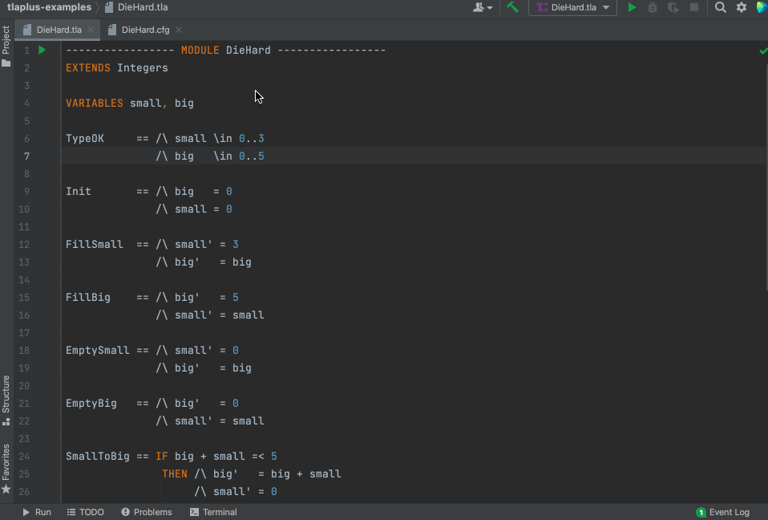
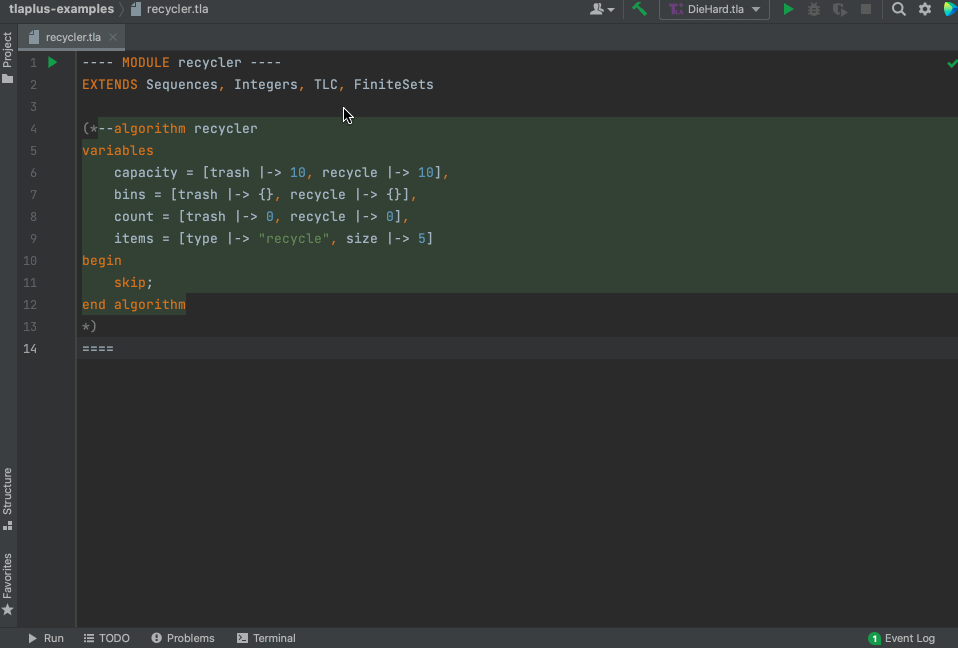
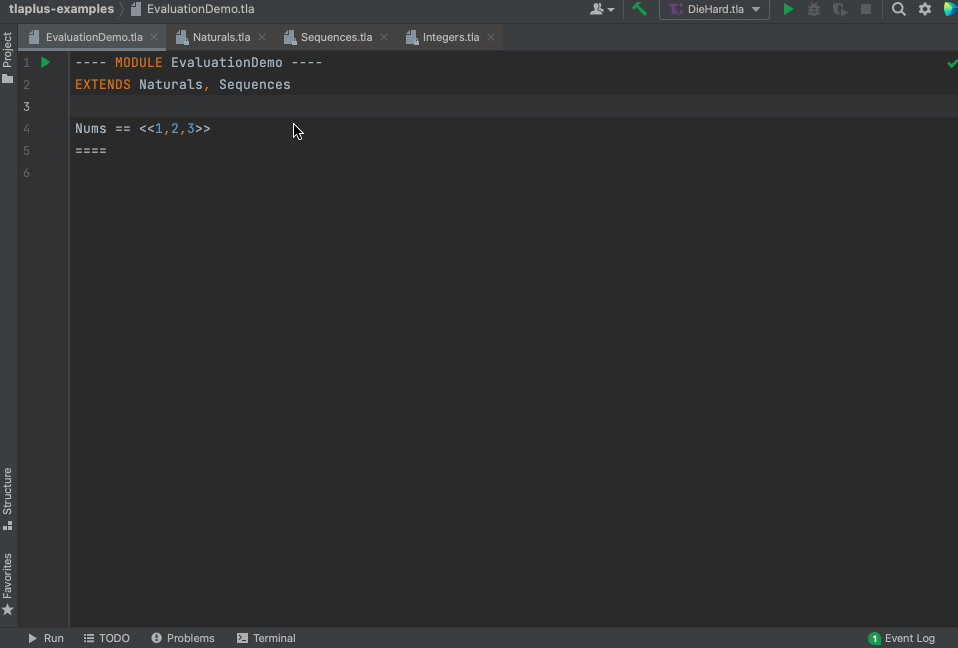

Intellij plugin for TLA+
========================

image:https://github.com/ocadaruma/tlaplus-intellij-plugin/workflows/CI/badge.svg?branch=master[link="https://github.com/ocadaruma/tlaplus-intellij-plugin/actions?query=workflow%3ACI+branch%3Amaster+event%3Apush"]
image:https://img.shields.io/jetbrains/plugin/v/17965-tla-[link="https://plugins.jetbrains.com/plugin/17965-tla-"]

Intellij plugin for https://lamport.azurewebsites.net/tla/tla.html[TLA+] formal specification language.

This plugin is heavily inspired by https://github.com/alygin/vscode-tlaplus[TLA+ for Visual Studio Code].

== Features

=== Syntax highlighting
* Supports syntax highlighting for TLA+, PlusCal, TLC cfg file

=== Run TLC model checker

==== Current limitations:
* You have to write TLC config file (`.cfg`) directly instead of GUI like toolbox
* TLC's command line args are not configurable
* Error trace exploration is not supported

=== Find usages (Go to declaration)
* References are searched across different modules including standard modules

=== Code completion
* Support basic keyword completion and variable/constant/operator name completion

=== PlusCal (Translate into TLA+)

=== Evaluate expression

